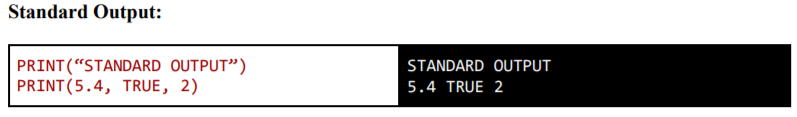
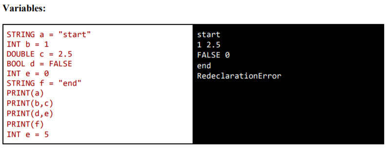
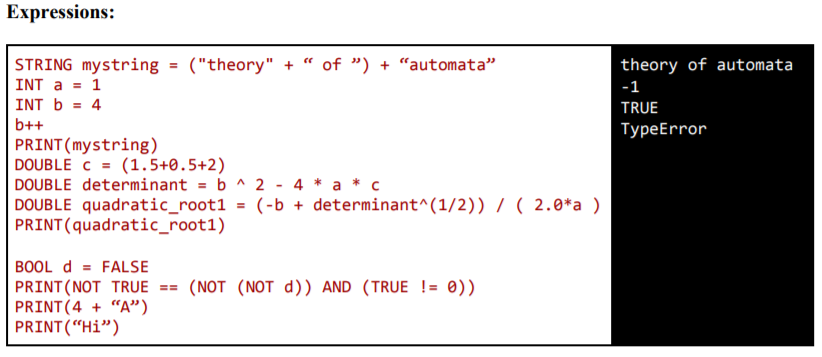
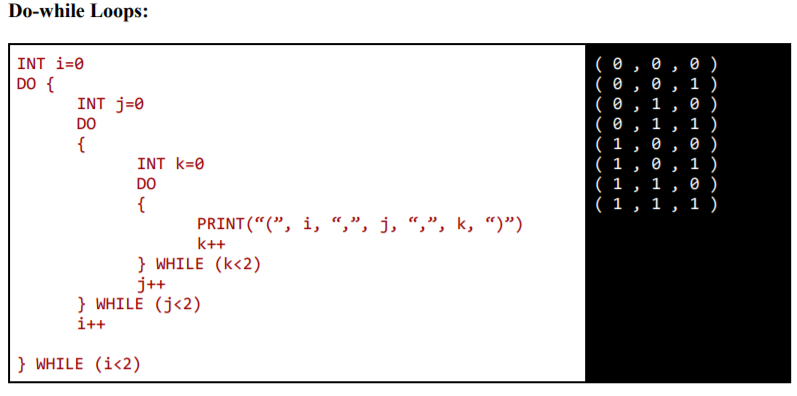
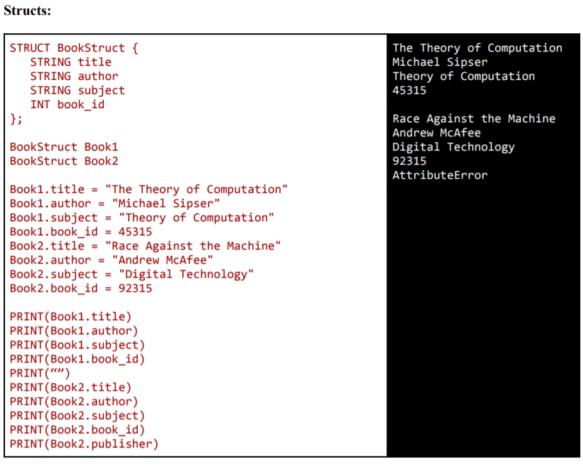

# YAPL-Automata
Created 'Yet Another Programming Language' in Python.

### Requirements
`pip install ply `

### Usage
`python3 interpreter.py <test_case> `

### Test Cases
There are certain test cases present in the /test_cases folder which test the robustness of our language.
The test cases in present in the folder may differ in syntax but they mimic the behaviour from the following:

